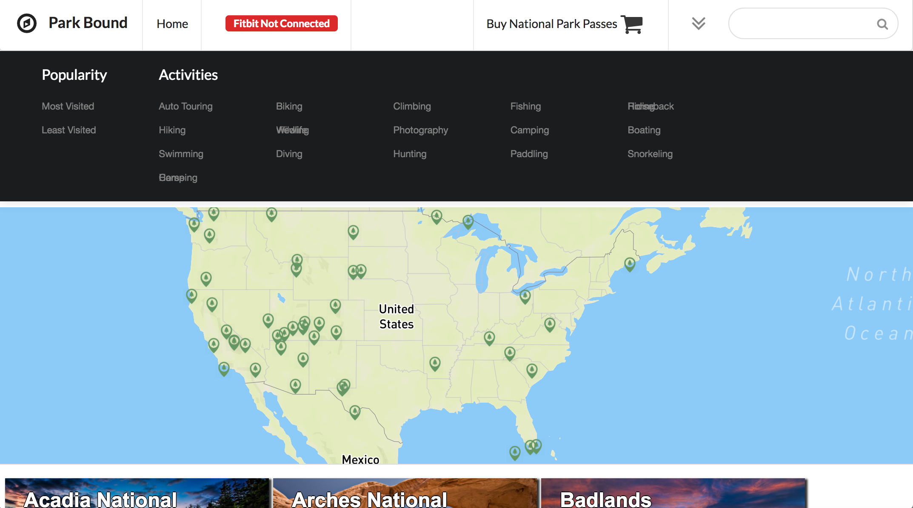
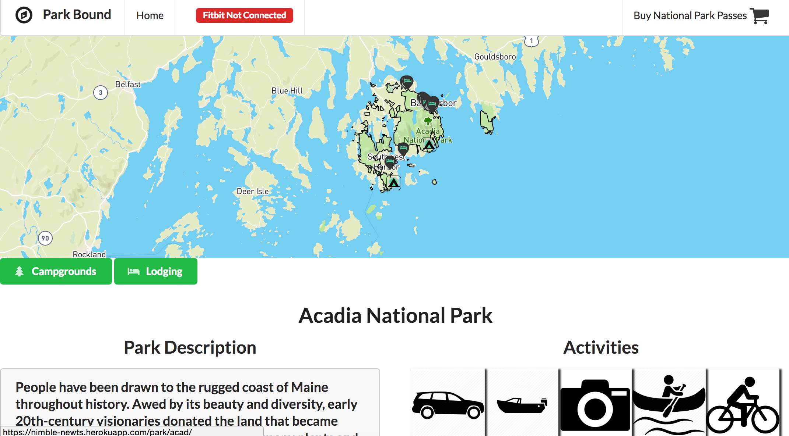

# ParkBound

ParkBound allows you to explore all of the US national parks. Users can narrow down their next desination by filtering through their preferences to find a park/s that are the best fit for them. 

 

## Team
  - [Tyler Walker](https://github.com/twalk4821)
  - [Justin Yoo](https://github.com/justinjyoo)
  - [Neil Ricci](https://github.com/iccir919)
  - [Nicholas Below](https://github.com/nkbelow)

## Table of Contents

## Usage

Firstly make sure that you have [Node](https://nodejs.org/en/download/) Version 6 or higher and [Git](https://git-scm.com/book/en/v2/Getting-Started-Installing-Git)  installed.
Next clone or download the repo. You can access the repo through your terminal by entering the following into your terminal:
```
git clone https://github.com/hrsf73-Nimble-Newts/Thesis
```
then change directories
```
cd Thesis
```
install the necessary packages locally
```
npm install
```
and run webpack in watch mode
```
npm run react-dev
```
and run the application in your local environment
```
npm run server-dev
```
The local version of ParkBound defaults to port 3000. Open up your browser and type [`localhost:3000`](http://localhost:3000) into your browser. Now your app should be up and running. If you'd like to run tests, please shut down the server by pressing control + c (mac) in the tab you ran react-dev. Run the testing suite by opening a new terminal tab and typing:
```
npm run test
```
Be sure to end the terminal testing process with control+c after testing has finished and restart your server with one of the server commands above. 

## Technologies

### Frontend
- React (ES6)
- Redux
- React Router v4
- Semantic UI

### Backend
- Node
- Express
- PostGreSQL
- Passport

### Hosting
- Heroku for deployment
- Cloudinary
- Github

### Testing
- Jest
- Enzyme
- Supertest

### Payments
- Stripe


## Contributing

See [CONTRIBUTING.md](CONTRIBUTING.md) for contribution guidelines.

